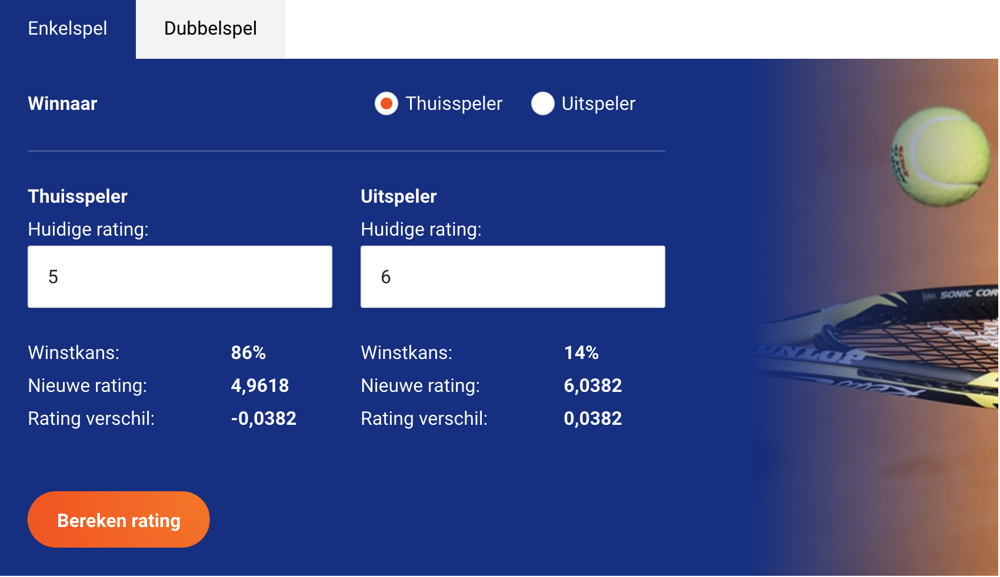

## KNLTB DSS rating calculator

This project aims to provide a GUI to calculate your new KNLTB rating.

## Roadmap
- DoubleGames
- Clean up code

## Requirements

- Calculations should be done according to official [explanation](https://www.tennis.nl/media/ornjxpds/dss-uitgebreide-uitleg.pdf) from KNLTB.
- Code is tested
- Implement CI/CD pipeline to run tests
- Implement calculator for Double matches

## Target implementation

[Tool](https://www.tennis.nl/alles-over-tennis/speelsterkte-rating/speelsterkte-rekentool/#ELOTool)

