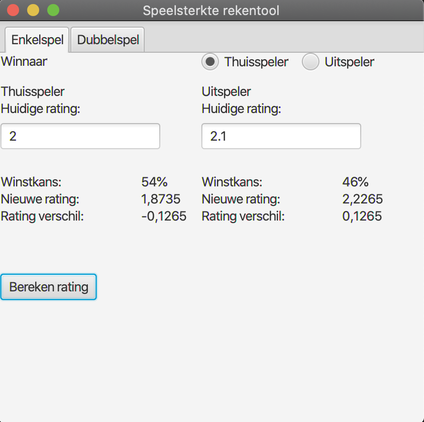
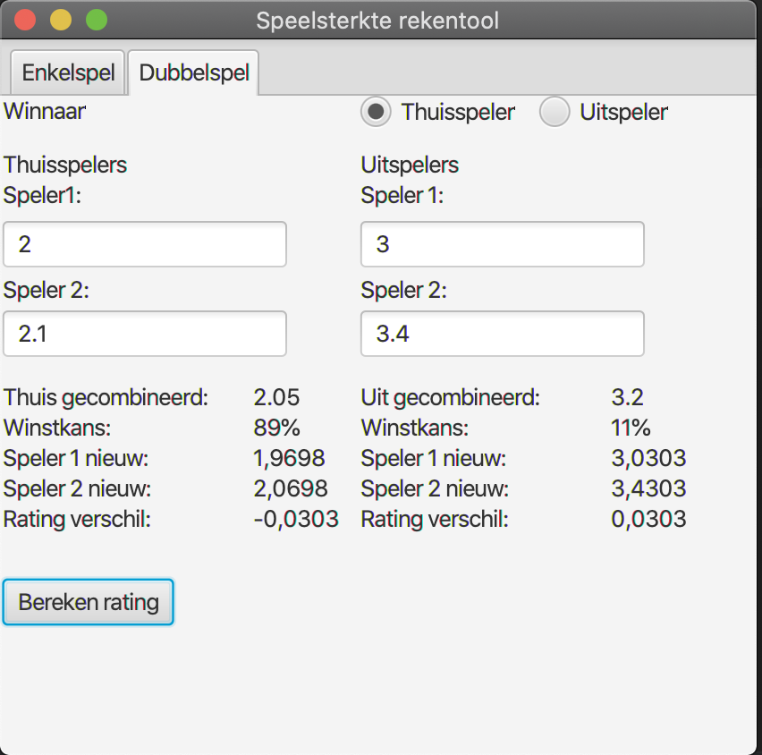

## KNLTB DSS rating calculator

This project aims to provide a desktop GUI to calculate your new KNLTB rating.
An official explanation of the calculations used to determine your rating can be found [here](https://www.tennis.nl/media/ornjxpds/dss-uitgebreide-uitleg.pdf).

### TODO
- Refactor
- Verify calculations (specifically rounding errors)

### Preview Singles

### Preview Doubles  
